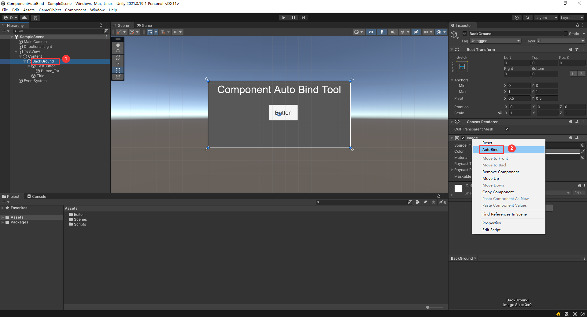
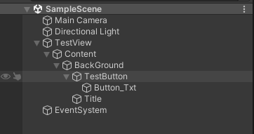

**自动生成获取组件的代码**


 
1. 选择物体
2. 在需要绑定的组件上 右键--->AutoBind
3. Ctrl+R刷新资，源编译生成的脚本


## **用法：**
复制[ComponentAutoBindTool.cs](/Assets/Editor/ComponentAutoBindTool.cs)，到自己工程中的Editor目录下。根据自己需求修改脚本，代码生成路径和生成代码的模板，是直接写在脚本中的。

## **效果：**
层次结构：
 


生成的脚本：
``` C#
namespace Game.UIManage
{
    public partial class TestViewManager : UIFormLogic
    {
        private UnityEngine.RectTransform BackGround;
        private UnityEngine.UI.Image BackGround_Img;
        private UnityEngine.UI.Image TestButton_Img;
        private UnityEngine.UI.Button TestButton_Btn;
        private UnityEngine.UI.Text Button_Txt_Txt;
        private UnityEngine.RectTransform Title;
        private UnityEngine.UI.Text Title_Txt;
//##INSERTPROPERTY##
        protected override void AutoBind()
        {
            BackGround = Content.Find("BackGround").GetComponent<UnityEngine.RectTransform>();
            BackGround_Img = Content.Find("BackGround").GetComponent<UnityEngine.UI.Image>();
            TestButton_Img = BackGround.transform.Find("TestButton").GetComponent<UnityEngine.UI.Image>();
            TestButton_Btn = BackGround.transform.Find("TestButton").GetComponent<UnityEngine.UI.Button>();
            Button_Txt_Txt = TestButton_Img.transform.Find("Button_Txt").GetComponent<UnityEngine.UI.Text>();
            Title = BackGround.transform.Find("Title").GetComponent<UnityEngine.RectTransform>();
            Title_Txt = BackGround.transform.Find("Title").GetComponent<UnityEngine.UI.Text>();
//##INSERTFUNCTION##
        }
    }
}

```
UIFormLogic：
``` C#
using UnityEngine;

namespace Game.UIManage
{
    public class UIFormLogic : MonoBehaviour
    {

        public Transform Content;
        public void Awake()
        {
            Content = transform.Find("Content");
        }
        protected virtual void AutoBind()
        {

        }
    }
}
```


